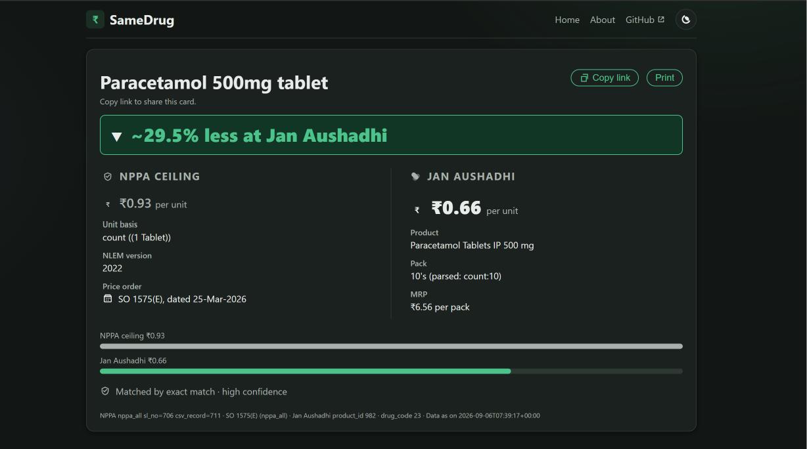
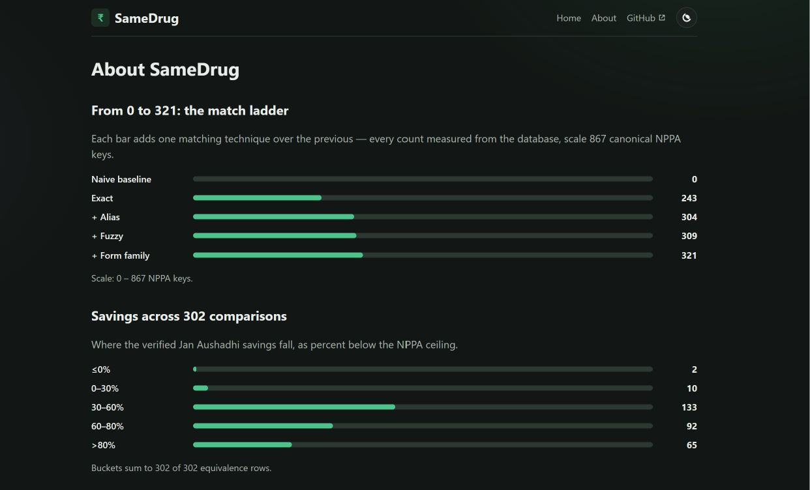

# SameDrug

Drug price transparency for India: NPPA ceiling prices vs Jan Aushadhi equivalents.


<!-- TODO(Phase 6): add CI badge once the build-and-push workflow exists. -->


<!--
Screenshot plan (docs/screenshots/):
  card.png       — equivalence card (embedded above) — EXISTS
  about.png      — /about story page, embedded in "What it does" below — EXISTS
  home.png       — home page hero — EXISTS, not embedded (keeps README fast to scroll)
  card-dark.png  — TODO: drop in when captured
  search.png     — TODO: drop in when captured
-->

## The problem

The same molecule sells at wildly different prices across brands, with spreads of 5–50x between the costliest option and the cheapest equivalent. Patients have no simple way to check what a drug should cost at most against its Jan Aushadhi alternative, and pharmacies rarely volunteer the cheaper option. The government data to answer this exists — NPPA ceiling prices and the Jan Aushadhi product list — but it is published in forms no patient can use: manual dashboard exports and a token-gated API.

## What it does

SameDrug joins those two sources on a canonical molecule + strength + form key and serves one shareable **equivalence card** per formulation: the NPPA ceiling vs the cheapest Jan Aushadhi equivalent, aligned per-unit, with a savings percentage, full provenance (SO number, source row, product ID), and honest caveats where the match is uncertain. That is **302 verified comparisons across 2,439 Jan Aushadhi products and 936 NPPA ceiling rows** — e.g. Paracetamol 500mg tablet: ₹0.93 ceiling vs ₹0.66 Jan Aushadhi (~29.5% less, SO 1575(E), product 982). The [/about page](docs/screenshots/about.png) tells the full story: the match ladder, the savings distribution, and the known exceptions.



## How it works

- **Phase 1** (`97a29d1..6e837c0`): reverse-engineered PMBJP's public guest-token API — 2 HTTP requests pull the full 2,439-product dataset; a second live pull matched the seed byte-for-byte. Documented in `docs/sources.md`.
- **Phase 2** (`87315c5..f086dcb`): NPPA compendium CSV parser — 937 price cells decomposed through a 69-qualifier grammar, 100% classified, 936 rows kept.
- **Phase 3** (`e551a31..49619eb`): normalization engine — molecule aliases, strength parsing (combos, concentrations, IU, %w/v), staged matching with the ladder 0 → 243 → 304 → 309 → 321 of 867 keys (37%).
- **Phase 3.5** (`1050ffc..ba32cc2`): audit-driven fixes — 22 cross-form capsule/tablet leaks eliminated, pack-condition + NLEM-vintage variant selection; equivalents 289 → 302.
- **Phase 4** (`fdfb403..9bd2286`): FastAPI read layer — tiered search, equivalents with provenance, cached stats, JAP lookup; the DB is opened read-only on every connection.
- **Phase 5.x** (`a0393b4..0424787`): server-rendered Jinja2 UI — fully functional with JavaScript disabled; theme toggle, copy-link, suggestions, and count-up are progressive enhancement only.

## The data

| Source | Tier | Acquisition | State |
|---|---|---|---|
| NPPA ceiling-price compendium (IPDMS export) | B | Manual export, pipeline validates on drop | Snapshot as-on 25-Mar-2026 (SO 1575/1581–1584(E)) |
| Jan Aushadhi product list (PMBJP public API) | A | Automated 2-request pull | 2,439 products, seed SHA in `docs/sources.md` |
| Category PDFs (anti-cancer, cardio, TB, HIV, diabetes) | C | Cross-validation only | 267 formulations at ±1% tolerance |
| 2 Para-5 retail price orders | Fixture | Parser-development samples (113 + 87 brand rows) | `data/raw/`, gitignored |

Data © NPPA / PMBJP. SameDrug is not affiliated with either body.

Known data-quality findings, kept visible rather than smoothed over: 387 zero-MRP rows, interpreted as “price not yet published” (corroborated by the PMBI site footnote) and excluded from comparisons; 1 true duplicate source row (Intermediate-acting Insulin 40 IU/ml, rejected at build); 2 genuine Jan-Aushadhi-above-ceiling findings — pheniramine 22.75mg injection (−32.5%) and dexamethasone 4mg/ml (−8.1%, a tax-basis artifact: 5.21 × 1.08 = 5.63 exactly); 2 slug collisions deterministically disambiguated. Every headline number above was re-measured by an independent audit query against `data/processed/drugs.db`, and a full rebuild reproduces the snapshot identically (302 equivalents).

## Architecture

```
NPPA export ─┐
             ├─▶ download ─▶ parse ─▶ normalize + match ─▶ SQLite ─▶ FastAPI ─▶ Jinja2 UI
JAP API ─────┘  (2 req)      (69-qualifier                       (read-only)    (zero-JS
                              grammar)                             302 equiv      functional)
```

```
SameDrug/
├── data/
│   ├── raw/                  # seeds — GITIGNORED (see docs/sources.md to acquire)
│   └── processed/drugs.db    # versioned build artifact (committed)
├── docs/                     # DESIGN.md, sources.md, screenshots/
├── samedrug/
│   ├── app/                  # main.py, queries.py, ui.py, templates/, static/
│   └── pipeline/             # sources/download/parsers/normalize/match/build_db
├── tests/                    # api/, pipeline/, ui/, fixtures/
├── pyproject.toml
├── LICENSE
└── README.md
```

## Quickstart

Windows/PowerShell (the project's native environment — every command below verified end-to-end):

```powershell
python -m venv .venv
.\.venv\Scripts\python.exe -m pip install -e ".[dev]"
.\.venv\Scripts\python.exe -m pytest            # 308 passed
.\.venv\Scripts\python.exe samedrug/pipeline/build_db.py   # needs data/raw seeds (gitignored)
.\.venv\Scripts\python.exe -m uvicorn samedrug.app.main:app --port 8000
# open http://localhost:8000
```

Linux/macOS (direct translation, not executed here):

```bash
python3 -m venv .venv && source .venv/bin/activate
pip install -e ".[dev]"
pytest
python samedrug/pipeline/build_db.py
python -m uvicorn samedrug.app.main:app --port 8000
```

Acquiring the seeds (`data/raw/` is gitignored by design): JAP via the live 2-request pull (`build_db.py --fetch`), NPPA via manual IPDMS export — full procedure and checksums in `docs/sources.md`. Verified this session: a from-seeds build to a temp path reproduced the snapshot exactly (302 equivalents, SHAs match), and the served `/health` reports `jap_products: 2439, nppa_ceiling_prices: 936, canonical_formulations: 2709, equivalents: 302`.

## Limitations

- **Coverage is 321 of 867 canonical NPPA keys (37%).** The unmatched backlog is understood, not mysterious: Jan Aushadhi doesn't stock whole categories NPPA schedules (anti-cancer, HIV, vaccines), NPPA lists forms JAP lacks, and the alias backlog is named — vitamin D3 (cholecalciferol) 60000 IU sachets, a brand-name table (Dolo etc.), paracetamol 150mg injection pack-variants.
- **Tax basis differs:** NPPA ceilings are tax-exclusive; Jan Aushadhi MRPs are tax-inclusive. Small gaps may be tax, not savings (see the dexamethasone note above).
- **Confidence tiers exist for a reason:** modifier-relaxed and form-family matches are marked low-confidence on their cards. Read the warning boxes.
- **Brand names land in the fuzzy tier:** searching “Dolo” won't resolve to paracetamol yet — the brand-alias table is roadmap, not shipped.
- **Freshness:** NPPA is a manual-export snapshot (as-on date above); JAP is a 2-request pull. Automated refresh with staleness alarms is Phase 6.

## Roadmap

| Status | Item |
|---|---|
| Done | Pipeline, normalization engine, read API, server-rendered UI, audit culture (302 equivalents, 308 tests) |
| Next | Docker image + deploy (Phase 6) |
| Next | Data-refresh automation with staleness alarms |
| Next | Brand-alias table for search (Dolo → paracetamol, …) |
| Next | Coverage backlog: vitamin D3/cholecalciferol, pack-variant injections, form-family review |

No dates — sequencing only.

## License + disclaimer

MIT (see `LICENSE`). **Informational only — NOT medical advice.** Verify with a pharmacist before buying or switching medicines. Ceiling prices © NPPA; Jan Aushadhi prices © PMBJP; SameDrug is not affiliated with either body.
